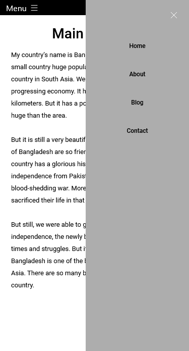
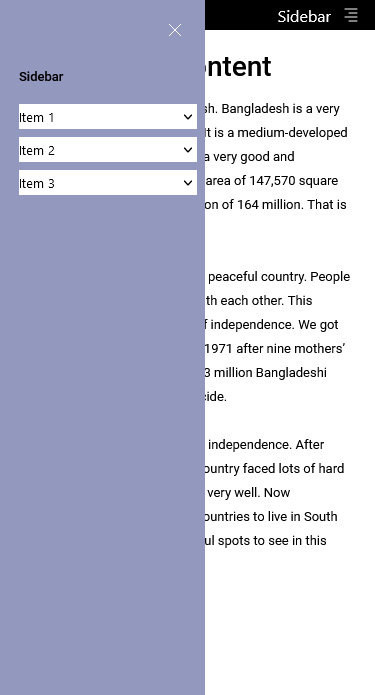
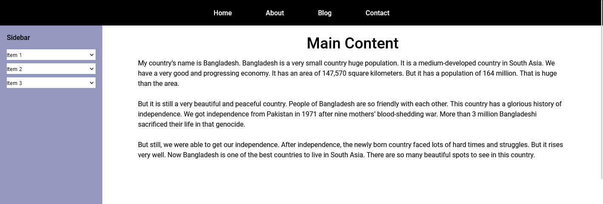

Creating a README.md file to explain how to run My Cyber Tech Solution's Frontend Intern Developer Screening Test React project.

## Table of Contents

- [My React Project with Vite](#my-react-project-with-vite)
  - [Prerequisites](#prerequisites)
  - [Getting Started](#getting-started)
  - [Running the Development Server](#running-the-development-server)
  - [Building for Production](#building-for-production)
  - [Folder Structure](#folder-structure)
  - [Contact](#contact)
  - [ScreenShort](#screenshort)

# My React Project with Vite

Welcome to my React project built with Vite! This README will guide you through the process of setting up and running the project on your local machine.

## Prerequisites

Before you begin, make sure you have the following software installed on your system:

- Node.js and npm

## Getting Started

1. Clone the repository to your local machine using Git:

```bash
git clone <https://github.com/shafiuljony/cyberTech-frontend-screening-test.git>
```

2. Navigate to the project's directory:

```bash
cd ./cyberTech-frontend-screening-test
```

3. Install project dependencies:

```bash
npm install
```

## Running the Development Server

To start the development server and run your React project, use the following command:

```bash
npm run dev
```

This command will start the Vite development server and open my project in your default web browser. Any changes you make to the source code will automatically trigger hot-reloading.

## Building for Production

To create a production-ready build of your React project, use the following command:

```bash
npm run build
```

This will generate an optimized build of your project in the `dist` directory.

## Folder Structure

Here's an overview of the project's folder structure:

- `src`: Contains React application source code.
- `src/components`: Contains All the components.
- `public`: Contains static assets that are served as-is.
- `dist`: Contains the production build of your project.

## Contact

If you have any questions or need further assistance, feel free to contact me:

- Name: Md. Shafiul Islam
- Email: shafiuljony12@gmail

 **Thanks for selecting me for Cyber Tech Solution's Frontend Intern Developer Screening Test!**

## ScreenShort

 
 
 
 
